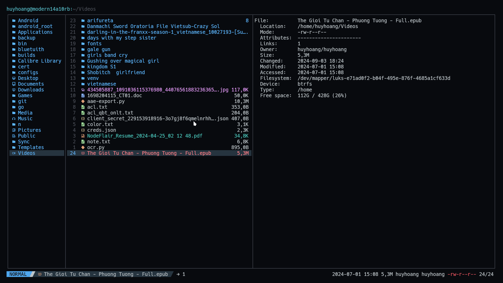

# file-extra-metadata

This is a Yazi plugin that replaces the default file metadata with extra information.

## Preview

Before:


After:



## Installation

Install the plugin:

```sh
ya pack -a boydaihungst/file-extra-metadata
```

Create `~/.config/yazi/yazi.toml` and add:

```toml
[plugin]
append_previewers = [
    { name = "*", run = "file-extra-metadata" },
]
```
